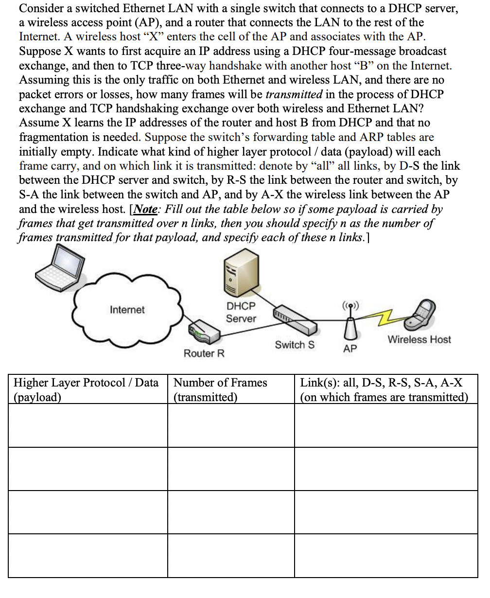
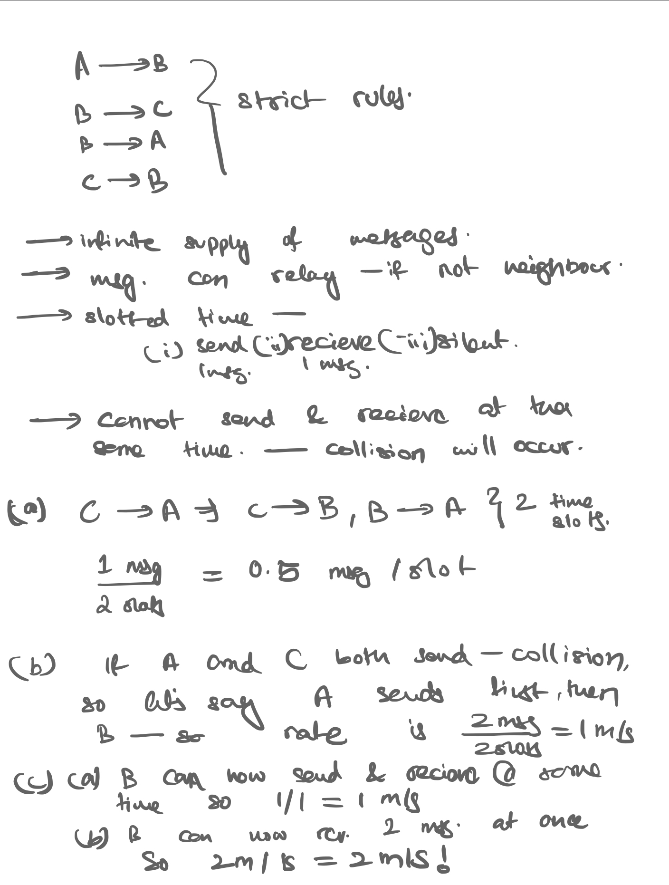

## Sample questions

*Answer*: For this problem, you can refer to [FAQ](dumb_questions.md) for clarification on what is a *frame*. Every point of communication here will emit a frame. 4 types of messages in DHCP: Discover, Offer, Request, Ack - all are broadcasts.

Assuming this is the only traffic on both Ethernet and wireless LAN, and there are no packet errors or losses, how many frames will be transmitted in the process of DHCP exchange and TCP handshaking exchange over both wireless and Ethernet LAN?

For DHCP exchange, the router will hit the Access Point (AP) first with DHCP broadcast, then it’ll hit the Switch S, then it’ll hit both DHCP server and Router R (since it has no clue where the DHCP server is). The 4 message type request will ask for 4 frames. Since we traversed 4 links, the emitted frames will be 4*4 = 16 frames.

```mermaid
sequenceDiagram
X ->> Access Point: Broadcast (1)
Access Point->> Switch: Broadcast (2)
Switch ->> DHCP server: Broadcast (3)
Switch ->> Router R: Broadcast (4)
```

ARP (Broadcast): When DHCP replies and allocates you IP, it also gives you IP of the router. This device has router’s IP address, but not MAC address, so for that we need to use ARP. This will be along all the links.

ARP (Reply): Now the router knows how to reach the device X directly, which is via R-S, S-AP, AP-X thus only 3 frames emitted.

Now finally, we have to consider the TCP 3 way handshake between X and B. We have to calculate the frames emitted in this network, thus we won’t calculate for R-B.

| higher layer protocol/data | number of frames transmitted | Links                                                  |
| -------------------------- | ---------------------------- | ------------------------------------------------------ |
| DHCP 4 message broadcast   | 4*4 = 16 frames              | X-AP, AP-S, S-DHCP, S-R                                |
| ARP (broadcast)            | 4 frames                     | X-AP, AP-S, S-DHCP, S-R                                |
| ARP (reply)                | 3 frames                     | R-S, S-AP, AP-X                                        |
| TCP 3-way handshake        | 3*(3 frames) = 9 frames      | X-AP, AP-S, S-R, R-B (3 way, so add links accordingly) |

## Sample question

Consider this wireless scenario: when A transmits, it can only be heard/received by B; both A and C can hear/receive from B; when C transmits, it can only be heard/received by B. Suppose now that each node has an infinite supply of messages to send to other nodes. If a message’s destination is not an immediate neighbor, then the message must be relayed. For example, if A wants to send to C, the message from A must be first sent to B, then B sends it to C. Assume time is slotted, and during each slot, a node can do one of the following: (i) send a message, (ii) receive a message (if exactly one message is sent to it), or (iii) remain silent. Thus, a node cannot send and receive at the same time. And if a node hears two or more simultaneous transmissions, a collision occurs. Assume here that there are no bit-level errors, thus if exactly one message is sent, it will be received correctly by those within the sender’s transmission range. Answer the following questions assuming an ideal collision-free MAC controller that knows the state of every node in the network and can command each node to do whatever it (the controller) wishes, i.e. to send a message, to receive a message, or to remain silent. 

(a) What is the maximum (steady-state) rate (expressed in messages/slot) at which data messages can be transferred from C to A, given that there are no other messages between any other source/destination pairs? 

(b) Suppose now that A and C both send messages to B. What is the combined maximum rate at which data messages can flow from A and C to B? 

(c) Suppose now that the wireless links are replaced by wired full-duplex links. Repeat questions (a) and (b) again in this wired scenario.

